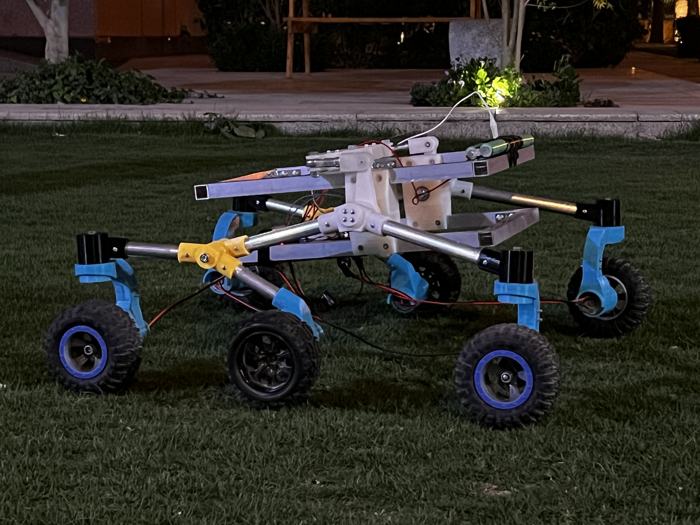

# 🌱 Smart Agriculture Robot 🚜  
Industry 4.0 lab, Prince Sultan University 
### A Wi-Fi Controlled Precision Farming Robot  



 This robot is designed to assist farmers by autonomously navigating fields, collecting data, and providing real-time updates via a web interface. It integrates **ESP8266 for navigation**, **Wi-Fi communication for remote access**, and **sensor-based data collection** to enhance efficiency in farming.  

---

## 📌 Features  
✅ **Autonomous Navigation** – Controlled via ESP8266 for precise movement  
✅ **Real-time GPS Tracking** – Farmers can monitor the robot’s position remotely  
✅ **Wi-Fi Communication** – Sends data to a farmer’s device seamlessly  
✅ **Web Dashboard** – User-friendly interface for live monitoring  
✅ **Data Collection** – Optimizing agriculture tasks 

---

## 🛠️ Hardware & Software  
### **🔧 Hardware Components**  
- ESP8266 (Wi-Fi microcontroller)  
- Motors & Motor Drivers  
- GPS Module NEO 6M GY-NEO6MV2
- Grove 3-Axis Digital Compass HMC5883L
- Ultrasonic sensor HC-SR04 
- Power Supply (Battery & Solar option)  

### **💻 Software & Technologies**  
- Embedded C++ (for ESP8266 firmware)  
- Python (for data processing)  
- HTML, CSS, JavaScript (for web interface)  
- MQTT / HTTP (for communication)  

---

## 🚀 Setup & Installation  
### **1️⃣ Hardware Setup**  
All hardware assembly instructions and electrical connections are detailed in the **final documentation file** located in the [`Documentation`](./Documentation) folder.  

### **2️⃣ Software Setup**  
1. Clone this repository:  
   ```sh
   git clone https://github.com/taynamghz/Agriculture-Robot.git
   cd Agriculture-Robot
2. Programming the ESP8266:
* Use Arduino IDE or VS Code with the Arduino extension (install the "Arduino" extension by Microsoft).
* Ensure you have the ESP8266 board package installed in Arduino IDE (Boards Manager -> ESP8266).
* Install required libraries (WiFi, Firebase, MQTT, etc.) as mentioned in ESP8266_Control/requirements.txt.
* Flash the ESP8266 firmware using the code in ESP8266_Control/.
3. Web Interface & Firebase Setup:
* Use VS Code for developing the web dashboard.
The interface is built using HTML, CSS, and JavaScript.
* Firebase is used for real-time data communication between the ESP8266 and the web interface.
Follow Firebase setup instructions in Web_Interface/README.md to configure database and authentication.
